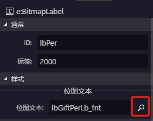

# egret wing hook

## 基于egret wing编辑器4.1.6版本的的修改

### egret wing 没有将资源代码归档到asar中，而是在Egret Wing 3\resources\app\下，所以修改app下的代码就可以修改wing编辑器

--------

__本仓库的修改包括以下部分：__

- image资源的跳转、skin文件的跳转、fnt资源跳转

    
    
    

- 散图资源的九宫格功能修复

    

- egret wing的启动优化（特化修改 - 对于电脑中装多一个版本的egret的可能会有egret sdk找不到的问题）

     - egret wing在启动时会运行两次egret versions的命令行，猜测是为了获取egret的所有版本，但是对于单版本的coder来说则不需要
     - 将该流程替换为 _[在获得第一个版本就结束、替换为egret info命令]_ 任一均可
     - 整体速度提升在60%以上，具体看命令行的运行效率